### Sobre

Sou o Enzo, estudante de Ciência da Computação na UVV (Vitória-ES, me formo em 2027) e estou em busca de um estágio em desenvolvimento.

Comecei a mexer com dados no estágio no Tribunal de Justiça do ES, escrevendo e mantendo scripts SQL em ambiente de homologação e trabalhando com PostgreSQL. De lá pra cá, fui atrás do que mais me interessa: construir coisas de ponta a ponta — hoje meus projetos vão do dado bruto ao modelo de machine learning servido numa API, com testes, CI e Docker.

### Projetos

<table>
<tr>
<td width="50%" valign="top">

#### [Agent Observability Hub](https://github.com/enzozon/agent-observability-hub)

Sistema multi-agente para análise de custos de frota: structured output, guardrails, observabilidade e eval harness, desenvolvido com TDD.

</td>
<td width="50%" valign="top">

#### [Encurtador de URL](https://github.com/enzozon/encurtador-url)

Encurtador de URL em Python stdlib pura, sem dependências externas — construído por times de agentes de IA.

</td>
</tr>
<tr>
<td width="50%" valign="top">

#### [Previsão de Churn](https://github.com/enzozon/python_ML)

Pipeline de ML completo: dois modelos comparados via MLflow, explicabilidade com SHAP e narrativas geradas pela Claude API, servido em FastAPI com testes, CI e Docker.

</td>
<td width="50%" valign="top">

#### [API Backend em Java](https://github.com/enzozon/projeto-java)

API RESTful com design de endpoints e boas práticas de arquitetura backend, testes via Postman e containerização.

</td>
</tr>
<tr>
<td width="50%" valign="top">

#### Análise de Crédito

Modelo preditivo para concessão de crédito a novos clientes: tratamento de dados, análise estatística e treinamento de algoritmos de ML.

</td>
<td width="50%" valign="top">

#### [Bot de Automação](https://github.com/enzozon/python_automacao)

Automação de tarefas repetitivas: controle de interface com PyAutoGUI e manipulação de dados com Pandas.

</td>
</tr>
<tr>
<td width="50%" valign="top">

#### [Air Math AI](https://github.com/enzozon/air_mathAI)

Matemática "no ar": reconhecimento de gestos com as mãos via visão computacional para resolver expressões escritas no ar.

</td>
<td width="50%" valign="top">

#### [PySpark Exemplos](https://github.com/enzozon/pyspark_exemplos)

Exemplos práticos de processamento distribuído de dados com PySpark.

</td>
</tr>
<tr>
<td width="50%" valign="top">

#### [BI Governance Toolkit](https://github.com/enzozon/bi-governance-toolkit)

Kit de suporte e governança para Power BI Service: cliente REST da Power BI API, auditoria de workspaces, relatório de acessos, biblioteca de medidas DAX e dashboard sobre um esquema estrela — com testes, CI e Docker.

</td>
</tr>
</table>

### Tecnologias

### Estatísticas

### Contato

[LinkedIn](https://www.linkedin.com/in/enzo-zon-ab71a7265/) · [enzozon7b@gmail.com](mailto:enzozon7b@gmail.com)
